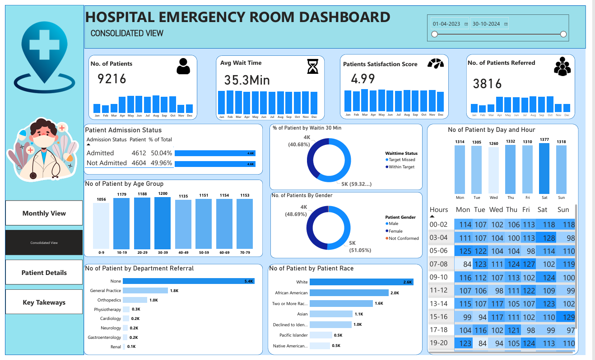
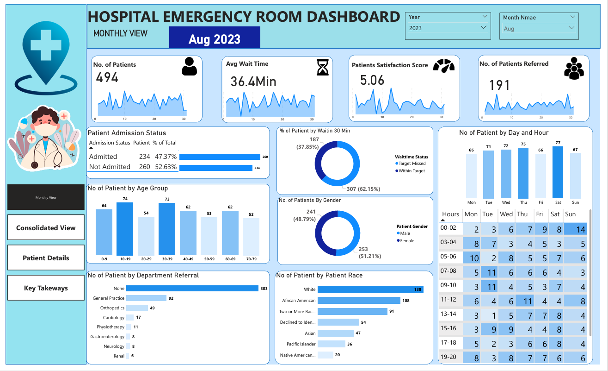
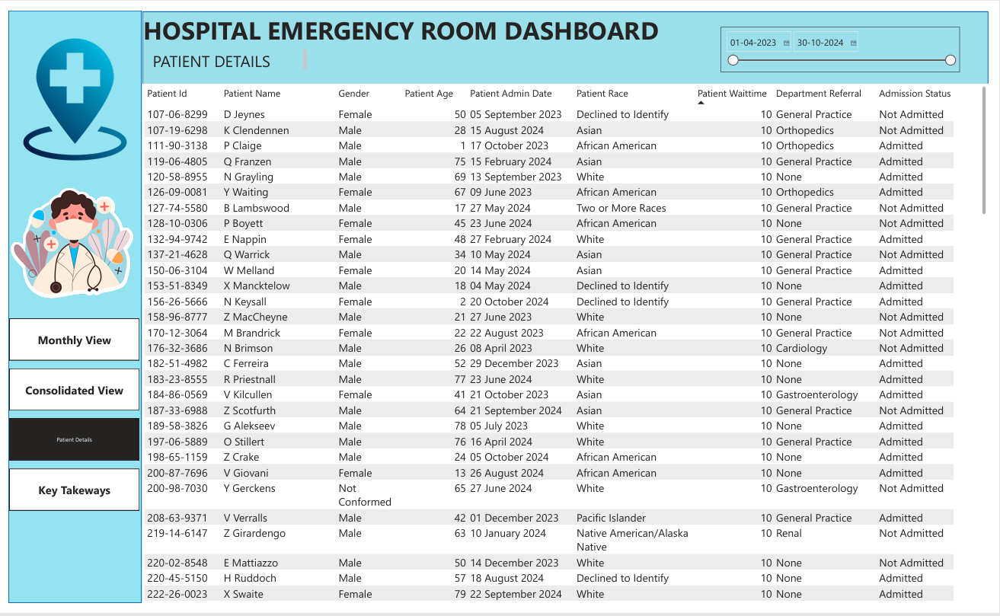
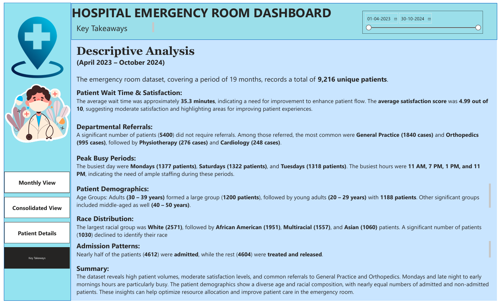

# Hospital-Emergency-Room-Analysis
## Overview
*- This dashboard provides a comprehensive view of Emergency Room (ER) operations in a hospital.*
It has two levels:
- Consolidated View (Yearly) – Summarizes data from April 2023 to October 2024.
- Monthly View (Example: August 2023) – Provides in-depth analysis for a single month.
 
  ---
## 1. Objective
- The goal of this dashboard project is to analyze Emergency Room (ER) performance at a hospital across different time frames. It provides both a consolidated yearly-level view (April 2023 – October 2024) and a granular monthly-level view (example: August 2023).
- By monitoring critical KPIs such as number of patients, waiting times, admission rates, referrals, demographics, and satisfaction scores, this project helps administrators identify patterns, bottlenecks, and opportunities for improving hospital operations.

---
## 2. Dataset
### [Hospital ER_Data.csv] https://github.com/abhi28408/Hospital-Emergency-Room-Analysis/blob/main/Hospital%20ER_Data.csv
---
## 3. Process / Methodology
- The dashboard development followed these steps:
#### Data Collection
- Patient records over 18 months were gathered.
- Variables included demographics (age, gender, race), treatment outcomes (admitted/not admitted), wait times, referrals, and patient satisfaction.
- Data Cleaning & Preparation
- Removed duplicates and corrected missing values.
- Standardized age ranges into categories (0–9, 10–19, etc.).
- Grouped referrals into hospital departments.
#### Dashboard Design
- Built four dashboards for different decision-making levels:
- Yearly (Consolidated) – Long-term trends and cumulative performance.
- Monthly – Detailed view of a single month for granular insights.
- Patients History Details.
- Keytakeaways.
#### Visualization Approach
- KPIs Cards – High-level summary metrics (Patients, Wait Time, Satisfaction, Referrals).
- Pie & Bar Charts – Admissions, Age Groups, Gender, Referrals, Race distribution.
- Line/Bar by Time – Day of week and hour analysis to capture workload peaks.
---
## 4.Dashboard Snapshots
🔹 Yearly view

🔹 Monthly view

🔹Patient Details

🔹Keytakeaways

---
## 5. Dashboard Breakdown
#### 🔹 A. Yearly Dashboard (Apr 2023 – Oct 2024)
- Patients: 9216 treated in total.
- Avg Wait Time: 35.3 minutes.
- Patient Satisfaction: 4.99 out of 5.
- Referrals: 3816 patients referred to departments.
- Admission Status: Balanced, ~50% admitted vs. not admitted.
- Age Groups: Most patients aged 20–39 years, indicating young adults are dominant ER users.
- Wait Time Efficiency: 59% seen within 30 minutes; 41% delayed.
- Gender Distribution: Almost equal (Male ~49%, Female ~51%).
- Referrals Distribution:
- None: 5.4K (majority)
- General Practice: 1.8K
- Orthopedics: 1K
- Others: ENT, Pediatrics, etc.
- Race Distribution: White (2.6K), African American (2K), others spread across Hispanic, Asian, Native American, etc.
- Day Trends: Mondays, Saturdays, and Sundays busiest.
- Hourly Trends: Peak between 08–12 hrs, calmest between 00–05 hrs.

#### 🔹 B. Monthly Dashboard (Example: August 2023)
- Patients: 494 treated in the month.
- Avg Wait Time: 36.4 minutes (slightly higher than yearly).
- Patient Satisfaction: 5.06 (slightly better than yearly).
- Referrals: 191 patients referred.
- Admission Split: Similar 50–50 balance.
- Age Groups: 30–39 remains highest, followed by 20–29.
- Day Trends: Saturday peak (77 patients).
- Hourly Trends: Evening (19–20 hrs) busy; early mornings less crowded.
---
## 6. Key Insights
- High Patient Load – Over 9,200 patients in 18 months, requiring consistent staff resources.
- Efficient Wait Times – Majority seen within 30 minutes, though ~40% still wait longer.
- Strong Patient Satisfaction – Scores near 5.0, indicating effective communication and treatment.
- Balanced Admissions – Roughly half admitted, half discharged, showing proper triage.
- Young Adults Dominate – ER usage is highest in 20–39 age groups, possibly due to accidents, lifestyle diseases, or higher activity levels.
- Weekends & Mondays are Peak – These need extra staffing and resource allocation.
- Department Referrals – General Practice and Orthopedics lead, highlighting common health issues.
- Race & Diversity – White and African American groups dominate, but multicultural representation exists.
- Hourly Peaks – Morning 8–12 AM surge requires optimized scheduling of doctors and nurses.
- Monthly Snapshot – August 2023 showed slightly longer wait times, but higher satisfaction, suggesting staff managed well despite load.
---
## 7. Conclusion
- The Emergency Room is performing strongly in patient satisfaction and overall efficiency. However, certain operational challenges exist:
- Load Balancing Needed: Weekends, Mondays, and morning rush hours require extra manpower.
- Wait Time Reduction: While 59% within 30 mins is good, further reducing delays for the remaining 41% can enhance efficiency.
- Targeted Resource Allocation: Since referrals are concentrated in General Practice and Orthopedics, those departments may need additional specialists.
- Focus on Young Adults: Outreach programs and preventive measures could reduce frequent ER visits by this age group.
- Overall, the ER has achieved an excellent service balance—high patient volume, short wait times, and very high satisfaction. With minor adjustments in staffing strategy and referral handling, performance can improve even further.
